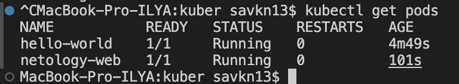
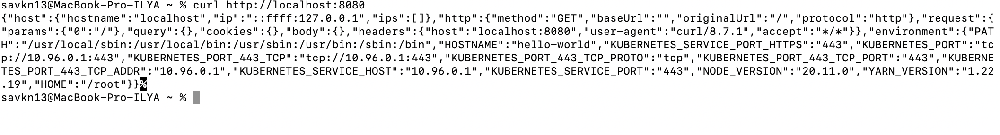
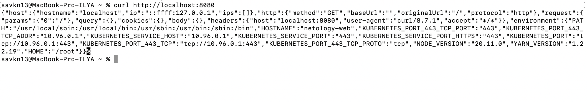

# Домашнее задание к занятию «Базовые объекты K8S» Савкин ИН

---

## Чеклист готовности

- Kubernetes запущен через Docker Desktop (kubeadm, 1 node, v1.34.1)
- kubectl установлен и настроен
- Контекст: docker-desktop

---

## Задание 1: Pod hello-world

Манифест: [hello-world-pod.yaml](hello-world-pod.yaml)

> Образ из задания `gcr.io/kubernetes-e2e-test-images/echoserver:2.2` не поддерживает ARM (Apple Silicon) — падает с ошибкой Lua VM. Использован совместимый аналог `ealen/echo-server:latest`, который реализует аналогичный функционал и поддерживает мультиплатформенные сборки (amd64/arm64).

### Запуск

```bash
kubectl apply -f hello-world-pod.yaml
```

### Проверка подов

```bash
kubectl get pods
```



### Подключение через port-forward

```bash
kubectl port-forward pod/hello-world 8080:80
curl http://localhost:8080
```



---

## Задание 2: Service netology-svc → Pod netology-web

Манифесты:
- [netology-web-pod.yaml](netology-web-pod.yaml)
- [netology-svc.yaml](netology-svc.yaml)

### Запуск

```bash
kubectl apply -f netology-web-pod.yaml
kubectl apply -f netology-svc.yaml
```

### Проверка Service

```bash
kubectl get svc
```

```
NAME           TYPE        CLUSTER-IP       EXTERNAL-IP   PORT(S)   AGE
kubernetes     ClusterIP   10.96.0.1        <none>        443/TCP   13m
netology-svc   ClusterIP   10.100.176.141   <none>        80/TCP    25s
```

Service типа `ClusterIP` привязан к поду `netology-web` через selector `app: netology-web`.

### Подключение через port-forward

```bash
kubectl port-forward svc/netology-svc 8080:80
curl http://localhost:8080
```



В ответе видно `"HOSTNAME":"netology-web"` — запрос прошёл через Service к нужному поду.
